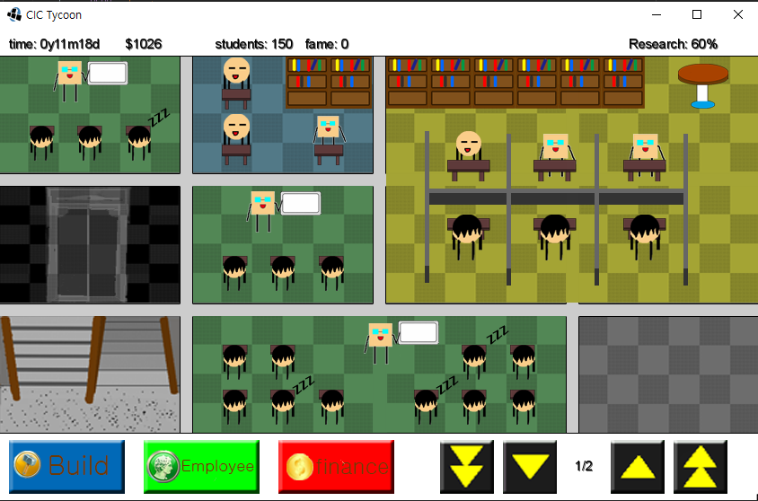
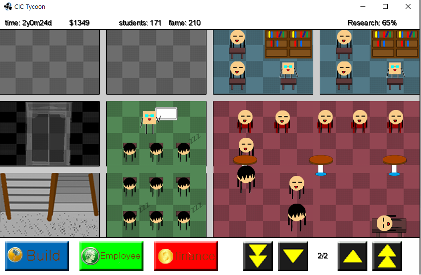

# [그룹] 단과대학 경영 게임 제작 프로젝트

**진행 기간**: 2013. 04. ~ 2013. 06.

**사용 언어/기술**: Java, libGDX2

**참여 인원**: 3명

## 소개

2013년도 당시 핫했던 libGDX2를 사용해보고자, 게임을 기획하고 개발했음. 옛날버전의 안드로이드와 PC를 지원함.

게임은 간단한 경영게임임. 초기 자본으로 교실을 추가해 학생을 받고, 교수님을 고용하거나 랩을 증설해서 명성을 올리면 됨.
명성이 올라가면 더 많은 학생이 와서 수입이 증가함. 공간이 모자라면 증축(??) 할 수 있음.
엔딩 조건 없음.

### 역할 및 기여

- 기획
- 리소스 수집/제작
- 자금 흐름 로직 개발

## 스크린샷

빈공간에 적절한 타입의 시설 배치

윗층의 빈공간에 적절한 타입의 시설 배치

교수님 고용

